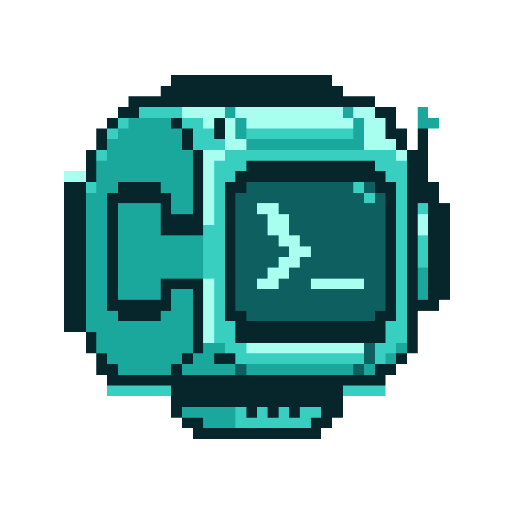

<p align="center">
  
</p>

<h1 align="center">Cli Claw</h1>

<p align="center">
  Powered By Any Agent CLI.
</p>

<p align="center">
  自托管的多用户本地 AI Agent 系统。
</p>

<p align="center">
  Inspired by <a href="https://github.com/riba2534/happyclaw">riba2534/happyclaw</a>.
</p>

<p align="center">
  <a href="LICENSE"></a>
  <a href="https://nodejs.org"></a>
  
  <a href="https://github.com/RyanProMax/cli-claw/stargazers"></a>
</p>

<p align="center">
  <a href="#cli-claw-是什么">介绍</a> · <a href="#核心能力">核心能力</a> · <a href="#快速开始">快速开始</a> · <a href="#开发文档">开发文档</a> · <a href="#贡献">贡献</a>
</p>

---

## Cli Claw 是什么

Cli Claw 是一个自托管、多用户的 CLI Agent 平台。它不重新实现 Agent 内核，而是把成熟的 CLI Agent 运行时封装成统一服务，让你通过 Web 和 IM 入口访问同一套工作区、文件、任务和流式执行能力。

当前接入的运行时：

- `claude`：Claude Agent SDK + Claude Code CLI
- `codex`：Codex CLI + `codex-acp`

主进程负责多用户隔离、消息路由、队列调度、持久化和 Web / IM 体验；真正的推理、工具调用和会话循环由底层 CLI runtime 执行。

## 核心能力

- 多用户工作区：每个用户拥有隔离的工作区、权限、运行时设置和长期记忆。
- 多入口接入：通过 Web 与多种 IM 通道访问同一工作区，消息统一路由。
- 多运行时执行：同一平台内支持 Claude Runtime 与 Codex Runtime。
- 流式体验：思考、文本、工具调用、任务事件和结果实时回传。
- 文件与任务：工作区文件管理、定时任务、记忆文件和 MCP 能力统一接入。
- 移动端 PWA：适配手机访问、查看执行状态和继续会话。

### 运行时概览

| `agentType` | 底层运行时 | 支持执行模式 | 认证方式 |
| --- | --- | --- | --- |
| `claude` | Claude Agent SDK + Claude Code CLI | `host` / `container` | Web 设置向导配置 Claude Provider |
| `codex` | Codex CLI + `codex-acp` | `host` | 宿主机执行 `codex login` |

## 快速开始

### 前置要求

- [Node.js](https://nodejs.org) >= 20
- [Docker](https://www.docker.com/)（仅容器模式需要；当前主要用于 Claude Runtime）
- 至少准备一种运行时认证方式：
  - Claude Runtime：在 Web 设置向导中配置 Claude Provider
  - Codex Runtime：在宿主机执行 `codex login`

### 安装启动

```bash
git clone https://github.com/RyanProMax/cli-claw.git cli-claw
cd cli-claw
make start
```

默认访问地址：`http://localhost:3000`

首次进入后按设置向导完成：

1. 创建管理员账号
2. 配置默认 Claude Provider（可选，但推荐先配）
3. 如需 Codex，在服务器执行 `codex login`
4. 如需 IM 通道，在 Web 设置页补充对应凭据

### 容器模式

如果需要容器模式，先构建镜像：

```bash
./container/build.sh
```

member 用户注册后默认会创建容器模式的主工作区；admin 主工作区默认使用宿主机模式。

### 常用命令

```bash
make dev
make build
make typecheck
make start
./scripts/validate.sh
./scripts/review.sh
```

### 端口

- 生产模式默认端口：`3000`
- 如需修改：

```bash
WEB_PORT=8080 make start
```

## 开发文档

仓库采用 owner-doc 方式维护上下文，避免同一事实散落在多个入口：

- [AGENTS.md](AGENTS.md)：仓库入口、必读顺序、复杂任务底线
- [docs/ARCHITECTURE.md](docs/ARCHITECTURE.md)：系统分层与核心数据流
- [docs/MODULE.md](docs/MODULE.md)：唯一维护的模块树 / 模块索引
- [docs/RUNTIME.md](docs/RUNTIME.md)：运行时矩阵与外部运行时契约
- [docs/CONTEXT.md](docs/CONTEXT.md)：工作区、记忆与持久化边界
- [docs/ENGINEERING.md](docs/ENGINEERING.md)：实施、验证、review / commit 规则
- [docs/COMMAND.md](docs/COMMAND.md)：命令行为与入口差异

复杂任务默认按仓库内的 `PLANS/ACTIVE.md` + `RUNBOOKS/*` 工作流执行；细节以 [AGENTS.md](AGENTS.md) 为入口，不在 README 中重复展开。

## 贡献

欢迎提交 Issue 和 Pull Request。

### 开发流程

1. Fork 仓库并克隆到本地
2. 创建功能分支：`git checkout -b feature/your-feature`
3. 开发并验证：`make dev`、`make typecheck`，必要时运行 `./scripts/validate.sh`
4. 提交代码并推送到 Fork
5. 创建 Pull Request 到 `main` 分支

### Commit 约定

commit message 使用英文，格式建议：`type: summary`

```text
fix: align message hover footer
feat: add codex runtime notes
refactor: simplify workspace routing
```

## Star History

[](https://www.star-history.com/#RyanProMax/cli-claw&type=date&legend=top-left)

## 许可证

[MIT](LICENSE)
