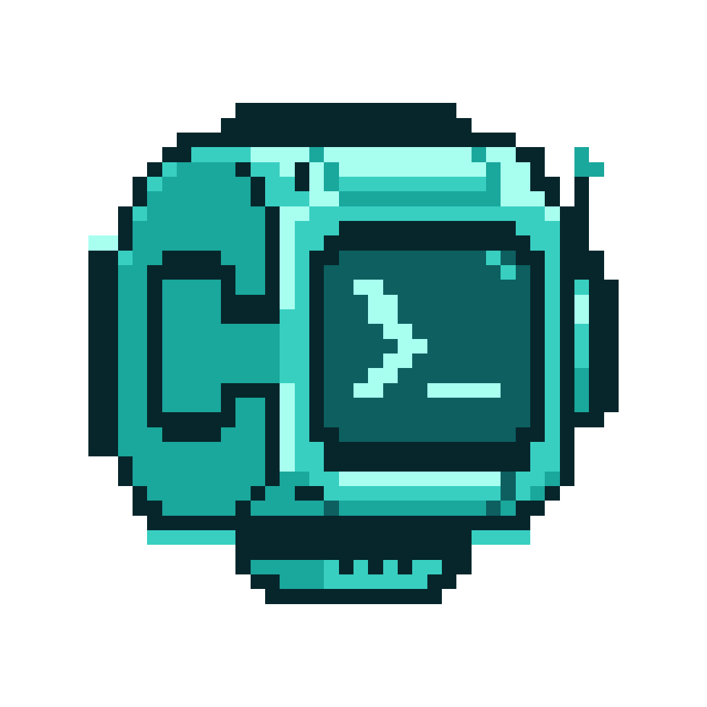

<p align="center">
  
</p>

<h1 align="center">Cli Claw</h1>

<p align="center">
  Powered By Any Agent CLI.
</p>

<p align="center">
  自托管的多用户本地 AI Agent 系统。
</p>

<p align="center">
  Inspired by <a href="https://github.com/riba2534/happyclaw">riba2534/happyclaw</a>.
</p>

<p align="center">
  <a href="LICENSE"></a>
  <a href="https://nodejs.org"></a>
  
  <a href="https://github.com/RyanProMax/cli-claw/stargazers"></a>
</p>

<p align="center">
  <a href="#cli-claw-是什么">介绍</a> · <a href="#核心能力">核心能力</a> · <a href="#快速开始">快速开始</a> · <a href="#开发文档">开发文档</a> · <a href="#贡献">贡献</a>
</p>

---

## Cli Claw 是什么

Cli Claw 是一个自托管、多用户的 CLI Agent 平台。它不重新实现 Agent 内核，而是把成熟的 CLI Agent 运行时封装成统一服务，让你通过 Web 和 IM 入口访问同一套工作区、文件、任务和流式执行能力。

当前接入的运行时：

- `openai`：OpenAI Agents SDK，复用宿主机 Codex CLI 登录态

主进程负责多用户隔离、消息路由、队列调度、持久化和 Web / IM 体验；真正的推理、工具调用和会话循环由底层 CLI runtime 执行。

## 核心能力

- 多用户工作区：每个用户拥有隔离的工作区、权限、运行时设置和消息审计。
- 多入口接入：通过 Web 与多种 IM 通道访问同一工作区，消息统一路由。
- Codex/OpenAI 执行：同一平台内支持 host 与 container 两种执行模式。
- 流式体验：思考、文本、工具调用、任务事件和结果实时回传。
- 文件与任务：工作区文件管理、定时任务和 MCP 能力统一接入。
- 移动端 PWA：适配手机访问、查看执行状态和继续会话。

### 运行时概览

| `agentType` | 底层运行时        | 支持执行模式         | 认证方式                    |
| ----------- | ----------------- | -------------------- | --------------------------- |
| `openai`    | OpenAI Agents SDK | `host` / `container` | 复用宿主机 Codex CLI 登录态 |

## 快速开始

### 前置要求

- [Node.js](https://nodejs.org) >= 20
- [Docker](https://www.docker.com/)（仅容器模式需要）
- 在宿主机执行 `codex login`

### 通过同名 launcher 启动

```bash
npm install -g cli-claw
cli-claw help
cli-claw version
cli-claw start
```

默认访问地址：`http://localhost:3000`

外部 launcher 说明：

- 仓库服务、launcher 和发布包统一使用 `cli-claw` 这个名字。
- 如需把 launcher 暴露到 PATH，可安装同名 npm 包 `cli-claw`；可执行命令保持为 `cli-claw <command>`。
- `cli-claw start` 启动服务。
- `cli-claw restart` 从外部 shell 请求一次安全自重启；它复用当前运行中 backend 保存的启动状态，不从调用方 shell 猜测启动命令。
- `cli-claw help` / `-h` / `--help` 查看 launcher 帮助。
- `cli-claw version` / `-v` / `--version` 查看已安装版本。
- 应用自身资源从安装包根目录解析，不依赖你启动时的当前目录。
- `cli-claw start` 会把“你启动命令时所在的目录”当作 host 工作区默认执行目录，并在缺失时物化到 `custom_cwd`。
- 数据库存储、sessions、logs、downloads 和工作区元数据仍保留在 `~/.cli-claw`，不会迁到启动目录。

### 安全重启

从外部 shell 重启正在运行的服务：

```bash
cli-claw restart
```

在 IM 管理员会话中重启：

```text
/self-restart
```

这两条入口都会走同一套 safe intent / watchdog 流程：先复用当前 backend 保存的启动命令做 shadow self-check，通过后才替换服务；结果以 `~/.cli-claw/ops/restarts/*.json`、`/self-status` 或 IM 成功回执为准。不要把 `kill`、`pkill`、`launchctl bootout` 当作日常重启入口。

如果还没有把 `cli-claw` 暴露到 PATH，在仓库目录可以临时使用 `bun src/cli.ts restart` 作为 repo-local fallback；长期运行仍推荐 `cli-claw start` / `cli-claw restart`。

### 从当前仓库启动（推荐）

```bash
git clone https://github.com/RyanProMax/cli-claw.git cli-claw
cd cli-claw
make start
```

推荐把这条路径当作日常运维和开发的主入口；这样 repo、服务和 launcher 都对应同一份工作树，不会再出现额外的包名心智负担。

首次进入后按设置向导完成：

1. 创建管理员账号
2. 确认宿主机已执行 `codex login`
3. 如需 IM 通道，在 Web 设置页补充对应凭据

### 容器模式

如果需要容器模式，先构建镜像：

```bash
./container/build.sh
```

这个命令是源码仓库相对路径，适用于 clone 后的开发 / 自建部署场景；不是在任意 launch cwd 下都可直接执行的全局命令。

member 用户注册后默认会创建容器模式的主工作区；admin 主工作区默认使用宿主机模式。

### 启动目录与数据目录

- host 工作区的默认执行 / 文件根目录来自 `cli-claw start` 的启动目录。
- 这个默认值会持久化到 `custom_cwd`，避免运行时依赖隐式内存 fallback。
- 工作区拥有的存储路径不变，仍以 `~/.cli-claw/groups/{folder}` 和 `~/.cli-claw/*` 下的数据为准。

### 常用命令

用户启动命令：

```bash
cli-claw help
cli-claw version
cli-claw start
cli-claw restart
```

仓库开发命令：

```bash
bun start
make dev
make build
make typecheck
make start
npm run release:check
./scripts/validate.sh
./scripts/review.sh
```

### 发布前检查

维护者在执行 `npm publish` 前，建议按这个顺序完成：

1. 先安装根仓库和子项目依赖：`make install`
2. 确认版本号已更新：`package.json` / `npm version <patch|minor|major>`
3. 确认 npm 身份与包权限可用：
   - `npm whoami`
   - 首次发布时确认 `cli-claw` 包名可用
   - 后续发布时确认自己仍是 maintainer：`npm owner ls cli-claw`
4. 跑本地发布检查：`npm run release:check`
5. 手工检查 packlist 与体积是否符合预期：

```bash
npm --cache /tmp/cli-claw-npm-cache pack --dry-run
```

至少确认输出里仍包含：

- `dist/`
- `web/dist`
- `shared/dist`
- `container/agent-runner/dist`
- `config/`
- `README.md`
- `LICENSE`

同时留意 tarball 体积是否异常上涨。

6. 做一次 tarball 安装 smoke，尽量使用临时 `HOME` 和临时 prefix，避免污染本机：

```bash
npm --cache /tmp/cli-claw-npm-cache pack
TMP_HOME="$(mktemp -d)"
TMP_PREFIX="$(mktemp -d)"
HOME="$TMP_HOME" npm install -g --prefix "$TMP_PREFIX" ./cli-claw-<version>.tgz
"$TMP_PREFIX/bin/cli-claw" help
"$TMP_PREFIX/bin/cli-claw" version
```

如需再做一次短启动 smoke，可以在新的临时 `HOME` 下启动后手动停止：

```bash
HOME="$TMP_HOME" WEB_PORT=3310 "$TMP_PREFIX/bin/cli-claw" start
```

7. 最后执行：`npm publish`

`npm run release:check` 会串联 `./scripts/validate.sh`、`./scripts/review.sh`、CLI 基础 smoke，以及带临时 cache 的 `npm pack --dry-run`，避免被本机 `~/.npm` 权限问题干扰；但它不替代 tarball 安装 smoke 和人为 packlist 审核。

### 端口

- 生产模式默认端口：`3000`
- 如需修改：

```bash
WEB_PORT=8080 cli-claw start
```

## 开发文档

仓库采用 owner-doc 方式维护上下文，避免同一事实散落在多个入口：

- [AGENTS.md](AGENTS.md)：仓库入口、必读顺序、复杂任务底线
- [docs/ARCHITECTURE.md](docs/ARCHITECTURE.md)：系统分层与核心数据流
- [docs/MODULE.md](docs/MODULE.md)：唯一维护的模块树 / 模块索引
- [docs/RUNTIME.md](docs/RUNTIME.md)：运行时矩阵与外部运行时契约
- [docs/MEMORY.md](docs/MEMORY.md)：记忆机制、上下文保留与增长边界
- [docs/ENGINEERING.md](docs/ENGINEERING.md)：实施、验证、review / commit 规则
- [docs/COMMAND.md](docs/COMMAND.md)：命令行为与入口差异

复杂任务默认按仓库内的 `PLANS/ACTIVE.md` + `RUNBOOKS/*` 工作流执行；细节以 [AGENTS.md](AGENTS.md) 为入口，不在 README 中重复展开。

## 贡献

欢迎提交 Issue 和 Pull Request。

### 开发流程

1. Fork 仓库并克隆到本地
2. 创建功能分支：`git checkout -b feature/your-feature`
3. 开发并验证：`make dev`、`make typecheck`，必要时运行 `./scripts/validate.sh`
4. 提交代码并推送到 Fork
5. 创建 Pull Request 到 `main` 分支

### Commit 约定

commit message 使用英文，格式建议：`type: summary`

```text
fix: align message hover footer
feat: add openai runtime notes
refactor: simplify workspace routing
```

## Star History

[](https://www.star-history.com/#RyanProMax/cli-claw&type=date&legend=top-left)

## 许可证

[MIT](LICENSE)
